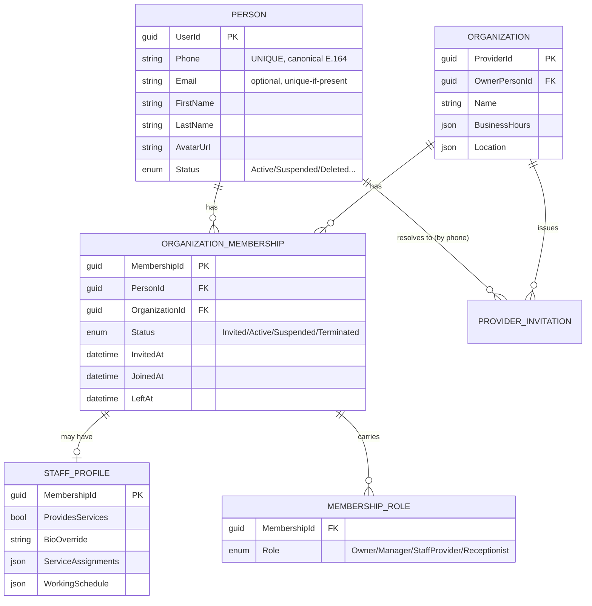
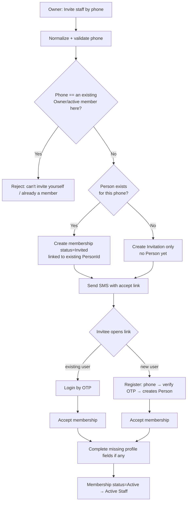
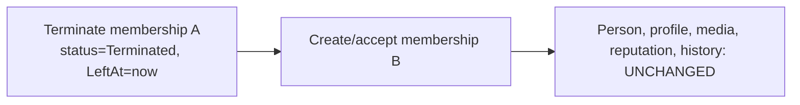

# Identity, Staff Membership & Onboarding Architecture

> **Status:** APPROVED AND LARGELY IMPLEMENTED (~80%). The Person → OrganizationMembership →
> StaffProfile model is live: one Person per phone, membership-based staff, members are bookable
> resources keyed by MembershipId, full lifecycle audit trail. Supersedes `add-provider-hierarchy`.
> Progress is tracked in `openspec/changes/refactor-identity-and-membership/tasks.md`.
> Remaining: Vue admin UI migration, salon switcher, staged data migrations, integration/E2E execution.
> **Scope:** `Booksy.UserManagement` + `Booksy.ServiceCatalog` bounded contexts (backend) and `booksy-provider-app` (Flutter). The Vue `booksy-frontend` is a secondary consumer flagged for follow-up alignment.
> **Author:** Architecture audit, 2026-07-21.

---

## 0. Executive Summary

The system was asked to model real-world salons where a **person** may own a business, work in one or several businesses, leave, rejoin, and become an owner later — without ever duplicating their account.

Today it cannot. The codebase contains **two competing, half-built staff models** and **no first-class concept of a Person, an Organization Membership, or a Staff Profile as separate things**:

- **Identity** collapses everything into one `User` aggregate keyed by **email** (unique), while **phone** — the actual login identifier — has **no unique constraint and not even an index**. Duplicate people on the same phone are a reproducible, everyday outcome.
- **Staff** is not an entity. A "staff member" is a whole second `Provider` (Individual) glued to the salon by a single `ParentProviderId`. The wired "add staff" path fabricates a throwaway `UserId.CreateNew()` and copies the salon's own phone/email onto it — an account-less duplicate with no identity.
- **Membership** does not exist. There is no join between Person and Organization, no role scoped to an organization, and no join/leave lifecycle. A person **structurally cannot** belong to two salons (`ParentProviderId` is a single scalar).
- **Onboarding** never asks whether the owner provides services and never makes the owner a staff member, so every new salon starts in a state the rest of the app treats as broken.

This document audits the current architecture, catalogs the problems against the eight required business scenarios, and proposes a **Person → OrganizationMembership → StaffProfile** model that satisfies all of them, with a phased migration that preserves existing data and reconciles the in-flight `add-provider-hierarchy` work rather than throwing it away.

---

## 1. Current Architecture

### 1.1 The three code sources that collided

| Model | Origin | Staff identity | Consumer | Multi-org? | Owner-as-staff? |
|---|---|---|---|---|---|
| **A — Staff child-record** | `complete-business-profile`, Flutter `implement-staff-management` | Inline name/email/phone on a record; **no account link** | **booksy-provider-app (Flutter)** | No concept | No concept |
| **B — Individual = child Provider** | `add-provider-hierarchy` (backend + Vue mostly built) | A whole `Provider(Individual)` with singular `ParentProviderId` | booksy-frontend (Vue) | **Explicitly rejected** (design Q#2 = "No") | **Deliberately implicit** (design Q#3 = Option B) |
| **Identity** | `UserManagement` | `User` keyed by email; phone optional/unindexed | Both | n/a | n/a |

Both A and B are partially wired into the same backend. The Flutter app calls the Model-A path (`POST /Providers/{id}/staff` → `AddStaffToProviderCommandHandler`), while the hierarchy invitation/join aggregates from Model B sit alongside, reachable only from Vue.

### 1.2 Identity — `Booksy.UserManagement`

```
User (AggregateRoot<UserId>)
├── Email            (required, UNIQUE index ix_users_email)
├── PhoneNumber?     (nullable, NO index, NO unique constraint)
├── HashedPassword
├── UserProfile      (child: name, avatar, bio, a SECOND phone copy)
├── List<UserRole>   (global string roles: "Customer" | "Provider")
├── UserStatus       (Draft, Pending, Active, Suspended, Inactive, Banned, Deleted)
└── UserType         (Customer | Provider | Both)
```

- **`UserId` (Guid)** is the only stable identity. `Email` is the enforced identity at the DB level; **phone is not**.
- **Global soft-delete filter** hides `Deleted` users from every query — including phone lookups.
- **Two OTP flows** (`complete-authentication` for customer and provider) upsert a user *by phone*. Two **email/password** flows write phone only to `UserProfile`, never to `User.PhoneNumber`.
- **Cross-context link:** ServiceCatalog `Provider.OwnerId` is the same `UserId`. Provider records are created *pull-based* by ServiceCatalog during onboarding from the JWT's user id. A `UserCreatedIntegrationEvent` handler exists but is a **no-op stub**.
- Login enrichment (`providerId` in the JWT) is fetched by an **HTTP call to `GET /api/v1/Providers/by-owner/{id}`** — an over-the-wire hop inside a single in-process monolith.

### 1.3 Provider / "Staff" — `Booksy.ServiceCatalog`

```
Provider (AggregateRoot<ProviderId>)
├── OwnerId : UserId               (the person who owns/registered it)
├── HierarchyType : Organization | Individual
├── ParentProviderId? : ProviderId (self-FK — the ONLY "membership" link)
├── IsIndependent : bool
├── Status : ProviderStatus
├── OwnerFirstName / OwnerLastName (denormalized identity)
└── (Staff.cs entity — ENTIRELY COMMENTED OUT / dead)

ProviderInvitation (AggregateRoot<Guid>)   — org → phone, 7-day expiry, Guid = token
ProviderJoinRequest (AggregateRoot<Guid>)  — existing Individual provider → org (by ProviderId)
```

- **A "staff member" is an `Individual` Provider** whose `ParentProviderId` points at the salon.
- **Three inconsistent creation paths:**
  1. `AddStaffToProviderCommandHandler` (**the one Flutter uses**) → `Provider.RegisterStaffMember(org, UserId.CreateNew(), …)`: **synthetic throwaway UserId**, copies the org's own email/phone, stores name inline, raises **no** membership event. No login, no account.
  2. `AcceptInvitationWithRegistrationCommandHandler` → creates a **brand-new** UserManagement user (rejects existing accounts with a 409 → throw), then a new Individual provider.
  3. `AcceptInvitationCommandHandler` / `ApproveJoinRequestCommandHandler` → **re-parents** an existing Individual provider by `ProviderId`.
- `StaffRole` enum exists but is **never persisted** — the staff read model hardcodes `Role: "Staff"`, `LeftAt: null`, and fabricates `JoinedAt`.
- Dead weight: commented-out `Staff.cs`, no-op `StaffSeeder`/`StaffDataSeeder`, six never-raised `Staff*Event` records with live-but-unreachable handlers.

### 1.4 Frontend — `booksy-provider-app` (Flutter)

- **Onboarding:** an 8-step linear wizard (business info → category → location → services → hours → gallery → preview → completion). **No "do you provide services?" step, no branching, owner never becomes staff.** A finished salon has **zero** staff, which the composer (`_NoStaffNotice`) and the Home activation checklist (`hasStaff`) both flag as a problem.
- **Staff:** `/more/staff` list + `StaffFormSheet` → `POST /Providers/{id}/staff`. Fields: first name (required), last name, **phone (optional)**, role (optional). **No invitation, no SMS, no account link.** `ProviderStaffMember` has no `userId`.
- **Auth/session:** phone + OTP; `ProviderSession` holds **one** `user` + **one** `providerId` + one status. No name-capture/registration screen, **no accept-invitation screen, no profile-completion screen, no salon switcher, no multi-membership model.**

### 1.5 How a booking is attributed today

Bookings can reference an `IndividualProviderId`, but for a solo org the org itself is bookable (`CanAcceptDirectBookings()` returns true for organizations). Slot generation needs at least one staff resource — which is exactly why the zero-staff onboarding outcome breaks the composer.

---

## 2. Problems

### 2.1 Against the First Principles

| First principle | Reality today |
|---|---|
| Person, Organization, Membership, Staff are **separate** | All collapsed into `User` + one overloaded `Provider` aggregate. No Membership, no Staff entity. |
| A person may **work in multiple businesses** | **Impossible.** `ParentProviderId` is a single scalar; `LinkToOrganization` throws if already set; one-provider-per-owner is enforced at registration. |
| A person may **leave / rejoin** | "Leaving" just nulls `ParentProviderId`; no `LeftAt`/history; rejoining a real user is blocked by the one-provider rule. |
| A person may **become an owner later** | No path; owner-ness is baked into `Provider.OwnerId` at creation. |
| Never duplicate a person | The default add-staff path **creates a fresh synthetic identity every time**; email/password + OTP produce duplicate accounts on the same phone. |

### 2.2 Against the eight required scenarios

| # | Scenario | Status today | Root cause |
|---|---|---|---|
| 1 | Solo provider, owner provides services, no invite, owner is first staff | ❌ | Onboarding never creates owner-as-staff; provider ends with zero staff |
| 2 | Owner manages but doesn't provide services → no staff record | ⚠️ partial | It's the *only* outcome, not a choice; can't distinguish from S1 |
| 3 | Owner has Owner **and** Staff role simultaneously | ❌ | Owner is never a staff/membership record; roles aren't org-scoped |
| 4 | Invite employee; reuse existing account by phone; else register→create | ❌ | Invite-with-registration **rejects** existing accounts (409→throw); self-invite is a `// TODO`; not wired into Flutter at all |
| 5 | Employee changes salon: terminate old membership, create new, keep identity/history/ratings | ❌ | No membership lifecycle; one-provider rule blocks it; history faked |
| 6 | Employee works in multiple salons simultaneously | ❌ | Structurally impossible (single `ParentProviderId`) |
| 7 | Owner invites themselves accidentally → prevented | ❌ | No self-invite guard (explicit `// TODO`) |
| 8 | Duplicate phone numbers never create two persons; enforced at DB **and** app | ❌ | **No unique index on phone; no index at all.** App checks only on OTP paths; email/password + soft-delete + cross-type all create duplicates |

### 2.3 Identity-layer defects (found in audit, independent of the redesign)

- **No unique constraint or index on `users.phone`** — uniqueness is best-effort application code only.
- Email/password registration leaves `User.PhoneNumber` null → later OTP login **creates a duplicate** for the same phone.
- Customer vs Provider on one phone → **two `User` rows** with synthesized emails (`{n}@booksy.customer` / `.provider`); email-unique never catches them.
- **OTP login never checks `Status`** → `Banned`/`Suspended`/`Inactive` users still get a fresh JWT (the status guard in `User.Authenticate()` is bypassed).
- `ExistsByEmailAsync` is **inverted** (returns `user == null`); only works today via double-negation.
- No `ExistsByPhoneNumberAsync`; phone lookups are unindexed full scans OR-ing several `EquivalentForms()`.
- `SetStatus` is an unguarded public escape hatch; `UpdateRoles` / `UpdateRefreshTokens` throw `NotImplementedException`.

### 2.4 Architectural smells

- **Two identity semantics for "staff"** (synthetic-UserId vs real-user vs re-parent) in one codebase.
- **Model A (Flutter) and Model B (Vue) disagree** on what staff *is*.
- Dead code (`Staff.cs`, seeders, orphan events) actively misleads.
- In-process context talks to itself over **HTTP** for provider lookup.

---

## 3. Proposed Architecture

### 3.1 The target model — five distinct concepts



**The five concepts, mapped to the code:**

1. **Person** = `UserManagement.User`, cleaned up to be the single identity for one human. **Phone is the globally-unique identity.** One Person whether they are customer, provider, owner, or staff. Ratings/media/reputation that are "about the human" live here (or a Person-scoped read model) so they survive salon changes.
2. **Organization** = `ServiceCatalog.Provider` of type `Organization` (the salon). Keeps `ProviderId`, hours, location, gallery, master service catalog.
3. **OrganizationMembership** = **NEW aggregate** in ServiceCatalog. Links `PersonId` (UserId) ↔ `OrganizationId` (ProviderId). Carries a **set of org-scoped roles**, a **status lifecycle**, and join/leave timestamps. **Many memberships per person (multi-salon); many per org (multi-staff).**
4. **StaffProfile** = an **owned entity of a membership**, present only when the membership provides services. Holds the `providesServices` flag, per-org bio, service assignments, and the working schedule *within* the org's hours. Multi-salon = one StaffProfile per membership (correctly, a different schedule per salon), but **one Person identity**.
5. **Roles & Permissions** = **per-membership** roles (`Owner`, `Manager`, `StaffProvider`, `Receptionist`, …), scoped to an organization — distinct from the **global** UserManagement roles (`Customer`, `Provider`, `Admin`) that govern platform access.

### 3.2 Why membership beats the two current models

- **Solves multi-org natively** (S6): a Person simply has N active memberships. No re-parenting, no duplicate accounts.
- **Owner-and-staff is just a role set** (S3): `{Owner, StaffProvider}` on one membership, with a StaffProfile.
- **Leave/rejoin is a lifecycle, with history** (S5): terminate membership A (status + `LeftAt`), create membership B; the Person, their profile, media and reputation are untouched because they never lived on the membership.
- **Invitation reuses identity by phone** (S4, S8): the invitation resolves to a Person by canonical phone; acceptance attaches a membership. It never creates a second Person.
- **Reconciles, not replaces:** `ProviderInvitation` and `ProviderJoinRequest` are **kept and rewired** to produce memberships. The booking flow's per-staff attribution is preserved by pointing bookings at `(OrganizationId, MembershipId)` instead of a second Provider.

### 3.3 What happens to "Individual = child Provider" (Model B)?

**Superseded as an *identity/membership* mechanism, retained only where it adds value.** The `ParentProviderId` self-relationship stops being how we express "works here." Two options for the per-org service resource (calendar/services/bio):

- **Option 3.3-A (recommended): StaffProfile owned by the membership.** The membership's StaffProfile carries schedule + service assignments. Bookings reference `MembershipId`. Simpler, no duplicate Provider rows, and multi-org falls out for free. Individual sub-Providers are migrated into StaffProfiles.
- **Option 3.3-B: keep an Individual Provider as a "service resource" owned by a membership.** Preserves the most in-flight code, but keeps the duplicate-Provider smell and complicates multi-org (one resource per membership). Only worth it if per-staff public discovery pages are a near-term requirement.

The recommendation is **3.3-A**; the doc's DB/API sections below assume it, and §8 notes the 3.3-B fallback.

### 3.4 Solo-provider handling (no artificial staff)

For a solo owner who provides services, the **owner's own membership** (roles `{Owner, StaffProvider}`, with a StaffProfile) is the bookable resource — there is no synthetic staff row and no `UserId.CreateNew()`. For an owner who does **not** provide services, the membership is `{Owner}` with **no** StaffProfile, and the org has zero bookable staff until one is invited.

---

## 4. UX Flows

### 4.1 Onboarding — add the "do you provide services?" branch

```mermaid
flowchart TD
    A[Business info] --> B[Category] --> C[Location] --> D[Services] --> E[Working hours]
    E --> Q{"Do you personally<br/>provide services?"}
    Q -- "Yes" --> Y[Owner membership = {Owner, StaffProvider}<br/>+ StaffProfile providesServices=true<br/>NO invitation]
    Q -- "No"  --> N[Owner membership = {Owner}<br/>no StaffProfile<br/>zero staff, invite later]
    Y --> G[Gallery] --> P[Preview] --> Z[Completion]
    N --> G
```

- New wizard step after Working Hours (kept optional-fast: a single Yes/No card).
- "Yes" makes the owner the **first active staff member automatically**, no invitation.
- "No" completes with zero staff and surfaces an "Invite your team" CTA instead of the current "missing staff" defect framing.

### 4.2 Invitation — reuse-by-phone first



Matches the requested flow exactly. Key guarantees: **one Person per phone**, self-invite blocked, existing accounts reused, new accounts created only when the phone is truly unknown.

### 4.3 Switch salon (change employer) — S5



No new user, ever. History rows for membership A are retained.

### 4.4 Multi-membership & salon switcher — S6

- `ProviderSession` gains a **`memberships[]`** collection (each: orgId, orgName, roles, status) plus an **`activeMembershipId`**.
- The provider app gains a **salon switcher** (in the app bar / More header). Switching sets the active membership; all Home/Calendar/Clients queries are scoped to it.
- A person with one membership sees no switcher (unchanged UX).

### 4.5 Screens to add in `booksy-provider-app`

| Screen | Purpose | Status |
|---|---|---|
| Onboarding "Do you provide services?" step | S1/S2 branch | **new** |
| Invite staff (phone-first) | S4 | replaces record-only `StaffFormSheet` |
| Pending invitations list | manage/resend/cancel | **new** |
| Accept invitation (existing user) | login → accept | **new** |
| Register + accept (new user) | phone → OTP → accept → profile | **new** (auth needs name capture) |
| Complete staff profile | fill missing fields post-accept | **new** |
| Staff list (roles, status, providesServices) | evolve current list | evolve |
| Salon switcher | S6 | **new** |

---

## 5. Domain Model (backend)

### 5.1 UserManagement (Person)

- Treat `User` as **Person**. Make **phone the primary identity**:
  - `PhoneNumber` becomes **required** for phone-first accounts and **globally unique** (canonical `Value`).
  - `Email` becomes **optional** but unique-if-present.
- Unify customer/provider onto **one Person per phone** using `UserType.Both` + additive roles, instead of two synthesized-email rows.
- Route **all** account creation through one guarded factory that enforces phone uniqueness and canonicalization.
- Enforce `Status` on the OTP completion path (reject `Banned`/`Suspended`/`Inactive`/`Deleted` before issuing tokens).
- Fix `ExistsByEmailAsync`; add `ExistsByPhoneNumberAsync`; remove dead `PhoneNumber` VO copy and legacy handlers; guard/implement `SetStatus`/`UpdateRoles`.

### 5.2 ServiceCatalog (Organization, Membership, StaffProfile)

New/changed aggregates & entities:

- **`OrganizationMembership`** (aggregate root)
  - `MembershipId`, `PersonId (UserId)`, `OrganizationId (ProviderId)`
  - `Roles : ISet<MembershipRole>` (`Owner`, `Manager`, `StaffProvider`, `Receptionist`, `Custom`)
  - `Status : MembershipStatus` (`Invited`, `Active`, `Suspended`, `Terminated`)
  - `InvitedAt?`, `JoinedAt?`, `LeftAt?`, `TerminationReason?`
  - Owns `StaffProfile?` (present iff `Roles` contains a service-providing role and `ProvidesServices`)
  - Invariants: at most **one non-terminated** membership per `(PersonId, OrganizationId)`; an org always has **≥1 `Owner`** membership; you cannot terminate the last owner.
  - Behavior: `Invite`, `Accept`, `Activate`, `AssignRole`/`RemoveRole`, `EnableStaffProfile`/`DisableStaffProfile`, `Suspend`, `Terminate(reason)`, `Reinstate`.
- **`StaffProfile`** (owned entity): `ProvidesServices`, `BioOverride`, `ServiceAssignments`, `WorkingSchedule` (validated within org hours).
- **`Provider`** keeps `Organization` semantics; `HierarchyType`/`ParentProviderId`/`IsIndependent`/`RegisterStaffMember` are **deprecated** and removed after migration.
- **`ProviderInvitation`** evolves: add self-invite + already-member guards; on accept, **resolve Person by canonical phone** and create/activate a membership (never a Provider, never a second Person).
- **`ProviderJoinRequest`** evolves: requester is a **`PersonId`**, approval creates a membership.

### 5.3 Domain events (rationalized)

- **Add:** `MembershipInvited`, `MembershipAccepted`, `MembershipActivated`, `MembershipRoleChanged`, `StaffProfileEnabled`, `MembershipTerminated`, `MembershipReinstated`.
- **Retire:** the six never-raised `Staff*Event` records and their dead handlers; `StaffMemberAddedToOrganizationEvent`/`RemovedFromOrganizationEvent` are replaced by the membership events.

---

## 6. Database Model

### 6.1 Identity (schema `user_management`)

```sql
-- Canonical, globally-unique phone. Partial unique to allow legacy phone-less rows,
-- policy-decided handling for soft-deleted (see §7).
ALTER TABLE user_management.users
  ALTER COLUMN phone_number TYPE varchar(20);           -- store canonical E.164

CREATE UNIQUE INDEX ux_users_phone_active
  ON user_management.users (phone_number)
  WHERE phone_number IS NOT NULL AND "Status" <> 6;     -- 6 = Deleted

-- Backfill User.PhoneNumber from user_profiles where User.PhoneNumber is null.
-- Deduplicate customer/provider parallel accounts onto one Person (UserType=Both).
```

### 6.2 Membership (schema `ServiceCatalog`)

```sql
CREATE TABLE "ServiceCatalog".organization_memberships (
  id                uuid PRIMARY KEY,
  person_id         uuid NOT NULL,          -- user_management.users.id
  organization_id   uuid NOT NULL REFERENCES "ServiceCatalog".providers(id),
  status            int  NOT NULL,          -- 0 Invited,1 Active,2 Suspended,3 Terminated
  invited_at        timestamptz NULL,
  joined_at         timestamptz NULL,
  left_at           timestamptz NULL,
  termination_reason text NULL,
  created_at        timestamptz NOT NULL,
  last_modified_at  timestamptz NULL
);
-- One live membership per person per org
CREATE UNIQUE INDEX ux_membership_person_org_active
  ON "ServiceCatalog".organization_memberships (person_id, organization_id)
  WHERE status <> 3;                        -- <> Terminated
CREATE INDEX ix_membership_org    ON "ServiceCatalog".organization_memberships (organization_id);
CREATE INDEX ix_membership_person ON "ServiceCatalog".organization_memberships (person_id);

CREATE TABLE "ServiceCatalog".membership_roles (
  membership_id uuid NOT NULL REFERENCES "ServiceCatalog".organization_memberships(id) ON DELETE CASCADE,
  role          int  NOT NULL,             -- Owner/Manager/StaffProvider/Receptionist/Custom
  PRIMARY KEY (membership_id, role)
);

CREATE TABLE "ServiceCatalog".staff_profiles (
  membership_id      uuid PRIMARY KEY REFERENCES "ServiceCatalog".organization_memberships(id) ON DELETE CASCADE,
  provides_services  boolean NOT NULL DEFAULT true,
  bio_override       text NULL,
  service_assignments jsonb NULL,
  working_schedule    jsonb NULL
);
```

- `ParentProviderId`, `provider_invitations`, `provider_join_requests` retained during migration; `parent_provider_id` dropped after backfill.
- Bookings gain `membership_id` (nullable during transition; backfilled from `individual_provider_id`).

### 6.3 All migrations idempotent (repo rule)

Guarded `IF NOT EXISTS` / `DO $$ ... $$` blocks; data backfill in a separate, re-runnable step; validated on a production clone before deploy gate.

---

## 7. Phone Number Rules & Edge Cases

**Before creating or inviting anyone:** normalize (canonical E.164 via `PhoneNumber.From`), validate country code, then look up an existing Person.

| Case | Expected behavior |
|---|---|
| Phone unknown | Create Person (registration) or a pending Invitation only (no Person yet). |
| Phone belongs to a person **already in another salon** | Reuse the Person; add a new membership. Never duplicate. (S6) |
| Phone has a **pending invitation** to this org | Idempotent — return/resend the existing invitation, don't stack duplicates. |
| Phone == an **Owner/active member of this org** | Reject (self-invite / already a member). (S7) |
| **Deleted** account (soft-deleted) | Policy decision (see below) — default: **reactivate** the same Person on successful OTP rather than mint a new one. |
| **Inactive** account | Allow invite; on accept, reactivate to `Active`. |
| **Blocked/Banned** account | Reject acceptance and login; surface a support path. Never issue tokens. |

**Enforcement is dual:** DB unique index (§6.1) **and** an application guard (`ExistsByPhoneNumberAsync` + canonicalization) in **every** creation path — OTP, email/password, invitation-accept-with-registration, and seeding.

**Open policy question for approval:** should a soft-deleted person's phone be *reclaimable* (unique index excludes Deleted, reactivate on return) or *permanently reserved* (full unique index)? Default recommendation: **reclaim + reactivate**.

---

## 8. API Changes

New/rewired endpoints (all under `/api/v1`, membership-centric):

| Method | Route | Purpose |
|---|---|---|
| `POST` | `/organizations/{orgId}/memberships/invitations` | Invite by phone (self-invite/dup guarded, reuse-by-phone) |
| `GET` | `/organizations/{orgId}/memberships/invitations` | Pending invitations |
| `POST` | `/memberships/invitations/{token}/accept` | Existing user accepts → membership Active |
| `POST` | `/memberships/invitations/{token}/register-and-accept` | New user: register (phone/OTP) → accept |
| `DELETE` | `/organizations/{orgId}/memberships/invitations/{id}` | Cancel invitation |
| `GET` | `/organizations/{orgId}/memberships` | Staff list (roles, status, providesServices) |
| `PATCH` | `/organizations/{orgId}/memberships/{id}` | Change roles / enable-disable StaffProfile |
| `POST` | `/organizations/{orgId}/memberships/{id}/terminate` | Terminate membership (S5) |
| `GET` | `/me/memberships` | The caller's memberships (for the salon switcher, S6) |
| `POST` | `/onboarding/owner-provides-services` | Onboarding branch: create owner StaffProfile or not (S1/S2) |

- **Deprecate** `POST/PUT/DELETE /Providers/{id}/staff` (Model A) and the `/providers/{id}/hierarchy/*` invitation/staff endpoints (Model B) behind the new membership endpoints; keep them as thin shims during transition.
- Replace the in-process **HTTP** `GET /Providers/by-owner/{id}` with a direct in-process query.
- JWT enrichment carries `memberships[]` + `activeMembershipId`.

---

## 9. Migration Strategy

Phased, backward-compatible, feature-flagged (`identity-membership-model`):

1. **Identity hardening (no behavior change).** Add canonical phone storage + partial unique index; backfill `User.PhoneNumber` from profiles; fix `ExistsByEmailAsync`; add `ExistsByPhoneNumberAsync`; add `Status` guard on OTP. Dedupe customer/provider parallel accounts (report first, merge second).
2. **Membership schema + aggregate** (tables in §6.2), events, repositories — no reads switched yet.
3. **Backfill memberships:**
   - Each `Organization` provider → one membership `{Owner}` for its `OwnerId`, `Status=Active`, `JoinedAt=RegisteredAt`. If the owner provided services (heuristic: solo org that took bookings), add `StaffProvider` + StaffProfile.
   - Each `Individual` sub-provider with `ParentProviderId` → a membership `{StaffProvider}` for a **resolved PersonId** (by phone if present; otherwise create a *claimable* Person or a StaffProfile with `PersonId=null` for not-yet-invited staff), migrating its schedule/services into the StaffProfile.
   - Model-A synthetic-UserId staff rows → StaffProfile with `PersonId=null` (a real person can later claim it by accepting an invitation on that phone).
4. **Rewire writes:** invitation/join/add-staff commands produce memberships; onboarding branch creates owner StaffProfile.
5. **Rewire reads:** staff list, booking attribution, session `memberships[]` read from the new tables.
6. **Flutter:** onboarding branch, invite/accept/complete-profile screens, salon switcher, `ProviderSession.memberships[]`.
7. **Cleanup:** drop `parent_provider_id`, delete `Staff.cs`/dead events/no-op seeders, remove deprecated endpoints after the flag is 100%.
8. **Vue `booksy-frontend`:** align its hierarchy UI to the membership endpoints (follow-up change, tracked separately).

Rollback: the flag gates reads; membership tables are additive; legacy columns retained until the final cleanup phase.

---

## 10. Risks / Trade-offs

| Risk | Mitigation |
|---|---|
| **Phone-uniqueness backfill finds real duplicates** (same human, two rows) | Dry-run report first; merge tool that repoints memberships/bookings to the surviving Person; manual review queue for ambiguous merges. |
| Soft-deleted rows collide with new unique index | Partial index excludes `Deleted`; reclaim-on-return policy (pending approval). |
| Bookings mid-flight during attribution switch | Dual-write `individual_provider_id` + `membership_id`; backfill; read from membership behind the flag. |
| In-flight `add-provider-hierarchy` work partially discarded | Retain invitation/join aggregates and booking-per-resource; only the *identity/parent* mechanism is superseded — framed as reconciliation, not rewrite. |
| Two frontends (Flutter + Vue) diverge further during transition | Membership endpoints are the single contract; Vue alignment tracked as an explicit follow-up. |
| DI/UoW collision (documented in identity audit) affects cross-context writes | Keep the established `SaveAndPublishEventsAsync` workaround; membership writes stay within ServiceCatalog's UoW. |
| Scope creep (this touches auth, onboarding, bookings, search) | Feature-flag + phase gates; each phase independently shippable and testable. |

---

## 11. Future Extensibility

- **Per-org RBAC / permissions** slot onto `MembershipRole` without touching Person or Organization.
- **Multi-location / franchises**: an Organization can gain a parent-org link *at the Organization level* (not the person level), independent of memberships.
- **Commission / payment splits** attach to the membership.
- **Request-to-join / marketplace discovery** already fits (`ProviderJoinRequest` → membership).
- **Person-level reputation** (ratings/media that follow the human across salons) is enabled because identity no longer lives on the salon.
- **"Become an owner later"** = add the `Owner` role to an existing membership, or create a new Organization owned by the same Person — no migration.

---

## 12. Scenario ↔ Design Traceability

| # | Scenario | Satisfied by |
|---|---|---|
| 1 | Solo provider, owner is first staff, no invite | Onboarding "provides services? Yes" → owner membership `{Owner, StaffProvider}` + StaffProfile (§4.1, §5.2) |
| 2 | Owner manages only | "provides services? No" → membership `{Owner}`, no StaffProfile |
| 3 | Owner + Staff simultaneously | Role set `{Owner, StaffProvider}` on one membership |
| 4 | Invite employee (reuse by phone / else register) | Invitation resolves Person by phone; accept/register-and-accept (§4.2, §8) |
| 5 | Change salon | Terminate membership A, create B; identity/history intact (§4.3) |
| 6 | Multiple salons | Many active memberships per Person; salon switcher (§4.4) |
| 7 | Self-invite prevented | Self-invite + already-member guards on invitation (§5.2, §7) |
| 8 | Duplicate phone impossible | Canonical phone, DB partial-unique index + app guard in every path (§6.1, §7) |

---

## 13. Testing Plan (to accompany implementation)

- **Domain/unit:** membership invariants (last-owner, one-live-per-person-per-org, role transitions), StaffProfile schedule-within-hours, phone canonicalization/uniqueness, invitation self-invite/dup/reuse-by-phone guards, all 8 scenarios as domain tests.
- **Integration (API + DB + events):** invite→accept (existing + new user), terminate→re-invite, multi-membership listing, onboarding branch, phone-uniqueness at the DB boundary (concurrent double-accept must not create two persons/memberships), status-gated OTP login.
- **Flutter widget/bloc:** onboarding branch cubit, invite/accept/complete-profile flows, salon switcher state, staff list states (loading/empty/error), `ProviderSession.memberships[]`.
- **E2E / keystone:** extend the keystone booking flow to cover owner-provides-services, invite-and-accept, and switch-salon without account duplication.
- **Regression:** each identity defect in §2.3 gets a failing-first test before its fix.

---

*End of review. Awaiting approval of the target model (and the open policy questions in §3.3 and §7) before implementation begins.*
