# Registration Progress API Consolidation

**Date**: 2025-11-25
**Status**: ✅ Complete
**Priority**: High

---

## Problem Identified

The codebase had **multiple duplicate API endpoints** for fetching draft/progress data during provider registration, causing confusion and inconsistency:

| Endpoint | Service | Used By | Status |
|----------|---------|---------|--------|
| `GET /v1/providers/draft` | `provider-registration.service.ts` | ❌ Nobody | ⚠️ Deprecated |
| `GET /v1/providers/draft` | `hierarchy.service.ts` | `OrganizationRegistrationFlow.vue` | ⚠️ Old (now fixed) |
| `GET /v1/registration/progress` | `provider-registration.service.ts` | `ProviderRegistrationFlow.vue` | ✅ **Correct** |

### Issues:
1. **Inconsistency**: Two different services calling different endpoints for the same purpose
2. **Confusion**: Developers didn't know which endpoint to use
3. **Maintenance**: Backend has to maintain multiple endpoints doing the same thing
4. **Data mismatch**: `/providers/draft` doesn't return `currentStep` or `hasDraft` boolean

---

## Solution Implemented

### ✅ Consolidated to Use `/v1/registration/progress`

**Why this endpoint is better:**
- ✅ Returns `hasDraft: boolean` for easy null checking
- ✅ Returns `currentStep` / `registrationStep` for page refresh handling
- ✅ Returns complete `draftData` object with all registration information
- ✅ Handles completed registrations gracefully (`hasDraft: false, providerId: "..."`)
- ✅ Consistent with the registration flow architecture

### Changes Made:

#### 1. Updated `hierarchy.service.ts` ✅
**File**: [hierarchy.service.ts](../booksy-frontend/src/modules/provider/services/hierarchy.service.ts#L36-L63)

```typescript
/**
 * Get current user's draft provider (if exists)
 * Uses the /registration/progress endpoint for consistency
 */
async getDraftProvider(): Promise<any> {
  try {
    const response = await serviceCategoryClient.get<any>('v1/registration/progress')

    // Extract draft data from progress response
    if (response.data?.hasDraft && response.data?.draftData) {
      const draft = response.data.draftData

      // Add registration step to the response for consistency
      return {
        ...draft,
        registrationStep: response.data.currentStep || draft.registrationStep
      }
    }

    return null
  } catch (error: any) {
    // Return null if no draft found (404)
    if (error.response?.status === 404) {
      return null
    }
    throw error
  }
}
```

**Impact:**
- ✅ `OrganizationRegistrationFlow.vue` now uses the correct endpoint
- ✅ `registrationStep` is properly restored on page refresh
- ✅ No more 404 errors from old `/providers/draft` endpoint

#### 2. Deprecated Old Method in `provider-registration.service.ts` ✅
**File**: [provider-registration.service.ts](../booksy-frontend/src/modules/provider/services/provider-registration.service.ts#L260-L278)

```typescript
/**
 * Get the current user's draft provider
 * @deprecated Use getRegistrationProgress() instead - this endpoint may be removed
 * @see getRegistrationProgress
 */
async getDraftProvider(): Promise<GetDraftProviderResponse> {
  // ... old implementation
}
```

**Impact:**
- ⚠️ Marked as `@deprecated` in JSDoc
- ⚠️ Developers will see deprecation warning in IDE
- ⚠️ Can be safely removed in future cleanup

---

## How Registration Progress Restoration Works

### Flow Diagram

```mermaid
sequenceDiagram
    participant User
    participant Browser
    participant Component
    participant Frontend API
    participant Backend

    User->>Browser: Navigates to /registration/organization
    Browser->>Component: Mount OrganizationRegistrationFlow
    Component->>Frontend API: hierarchyService.getDraftProvider()
    Frontend API->>Backend: GET /v1/registration/progress

    alt Has Draft
        Backend-->>Frontend API: { hasDraft: true, currentStep: 5, draftData: {...} }
        Frontend API-->>Component: Returns draft with registrationStep
        Component->>Component: Set currentStep = 5
        Component->>Component: Populate all form fields
        Component->>User: Shows step 5 with pre-filled data
        Component->>User: Toast: "ثبت‌نام شما بازیابی شد..."
    else No Draft
        Backend-->>Frontend API: { hasDraft: false, providerId: null }
        Frontend API-->>Component: Returns null
        Component->>Component: Set currentStep = 1
        Component->>User: Shows step 1 (fresh start)
    end
```



### Code Flow

#### 1. **User Refreshes Page at Step 5**
```
/registration/organization (current URL)
                ↓
    OrganizationRegistrationFlow.vue mounts
                ↓
    onMounted() calls hierarchyService.getDraftProvider()
                ↓
    GET /v1/registration/progress
                ↓
    Response: { hasDraft: true, currentStep: 5, draftData: {...} }
                ↓
    currentStep.value = 5 (line 331)
                ↓
    Restore all form fields (lines 335-371)
                ↓
    User sees Step 5 with populated data ✅
```

#### 2. **New User (No Draft)**
```
/registration/organization (current URL)
                ↓
    OrganizationRegistrationFlow.vue mounts
                ↓
    onMounted() calls hierarchyService.getDraftProvider()
                ↓
    GET /v1/registration/progress
                ↓
    Response: { hasDraft: false, providerId: null }
                ↓
    currentStep.value = 1 (default)
                ↓
    Empty form fields
                ↓
    User sees Step 1 (fresh start) ✅
```

---

## Verification Steps

### Manual Testing

1. **Test Draft Restoration:**
   ```bash
   1. Navigate to /registration/organization
   2. Complete steps 1-3 (creates draft in backend)
   3. Navigate to step 4 or 5
   4. Refresh the page (F5 or Ctrl+R)
   5. ✅ Verify: You're still on step 4/5 (not step 1)
   6. ✅ Verify: All form fields are populated
   7. ✅ Verify: Toast message appears: "ثبت‌نام شما بازیابی شد..."
   ```

2. **Test New Registration:**
   ```bash
   1. Log out
   2. Create new provider account
   3. Navigate to /registration/organization
   4. ✅ Verify: You see step 1 (not an error)
   5. ✅ Verify: No 404 errors in console
   ```

3. **Check Browser Console:**
   ```javascript
   // Should see logs like:
   "📋 Found existing draft provider: {...}"
   "✅ Provider ID loaded from progress: <guid>"
   ```

4. **Check Network Tab:**
   ```
   ✅ Should see: GET /v1/registration/progress (200 OK)
   ❌ Should NOT see: GET /v1/providers/draft
   ```

### API Response Format

**Expected Response from `/v1/registration/progress`:**

```json
{
  "hasDraft": true,
  "currentStep": 5,
  "providerId": "550e8400-e29b-41d4-a716-446655440000",
  "draftData": {
    "providerId": "550e8400-e29b-41d4-a716-446655440000",
    "registrationStep": 5,
    "hierarchyType": "Organization",
    "businessName": "My Salon",
    "businessDescription": "Best salon in town",
    "category": "Hair",
    "phoneNumber": "+989123456789",
    "email": "owner@example.com",
    "ownerFirstName": "علی",
    "ownerLastName": "رضایی",
    "address": {
      "street": "خیابان ولیعصر",
      "city": "تهران",
      "state": "تهران",
      "postalCode": "1234567890",
      "latitude": 35.6892,
      "longitude": 51.3890
    },
    "services": [...],
    "businessHours": [...],
    "staff": [...]
  }
}
```

---

## Backend Requirements

### ⚠️ Backend Checklist

To ensure this works correctly, the backend **MUST**:

1. ✅ **Save `registrationStep` in database** when each step is completed
   ```csharp
   // Example: After step 4 (services)
   provider.RegistrationStep = 4;
   await _providerRepository.UpdateAsync(provider);
   ```

2. ✅ **Return `registrationStep` in `/registration/progress` response**
   ```csharp
   return new RegistrationProgressResponse
   {
       HasDraft = true,
       CurrentStep = provider.RegistrationStep,
       ProviderId = provider.Id.Value,
       DraftData = new DraftDataDto
       {
           RegistrationStep = provider.RegistrationStep, // Important!
           BusinessName = provider.BusinessName,
           // ... other fields
       }
   };
   ```

3. ✅ **Update `registrationStep` in all step endpoints**
   - Step 3: Set to 3 after location saved
   - Step 4: Set to 4 after services saved
   - Step 5: Set to 5 after working hours saved
   - Step 6: Set to 6 after gallery saved
   - Step 7: Set to 7 after preview confirmed
   - Step 8: Set to 8 on completion

4. ✅ **Handle completed registrations**
   ```csharp
   // If registration is complete (status != Drafted)
   return new RegistrationProgressResponse
   {
       HasDraft = false, // No draft anymore
       ProviderId = provider.Id.Value, // But still return ID
       CurrentStep = 8 // Completed
   };
   ```

---

## Benefits

### For Developers:
- ✅ **Single source of truth**: Only one endpoint to remember
- ✅ **Type safety**: Better TypeScript types with `hasDraft` boolean
- ✅ **Clearer code**: Less confusion about which service to use
- ✅ **Easier debugging**: All progress calls go through same endpoint

### For Users:
- ✅ **Better UX**: Registration progress preserved on refresh
- ✅ **No data loss**: All form data restored exactly as entered
- ✅ **Clear feedback**: Toast message confirms restoration
- ✅ **Faster completion**: Can continue where they left off

### For Backend:
- ⚠️ **Can deprecate** `/v1/providers/draft` endpoint (once verified unused)
- ✅ **Simpler API**: Only need to maintain one endpoint
- ✅ **Better analytics**: Track exact step where users drop off

---

## Migration Path (For Backend Team)

### Phase 1: Current State ✅
- Both endpoints exist and work
- Frontend now uses `/registration/progress` exclusively
- Old `/providers/draft` marked as deprecated

### Phase 2: Monitor (2 weeks)
- Check backend logs for `/providers/draft` usage
- Verify no external integrations use it
- Ensure all frontend code migrated

### Phase 3: Remove (Future)
- Delete `/providers/draft` endpoint
- Remove deprecated frontend method
- Update API documentation

---

## Related Files

### Frontend:
- ✅ [hierarchy.service.ts](../booksy-frontend/src/modules/provider/services/hierarchy.service.ts) - **Updated**
- ✅ [provider-registration.service.ts](../booksy-frontend/src/modules/provider/services/provider-registration.service.ts) - Deprecated old method
- [OrganizationRegistrationFlow.vue](../booksy-frontend/src/modules/provider/views/registration/OrganizationRegistrationFlow.vue) - Uses hierarchy service
- [ProviderRegistrationFlow.vue](../booksy-frontend/src/modules/provider/views/registration/ProviderRegistrationFlow.vue) - Uses registration service
- [useProviderRegistration.ts](../booksy-frontend/src/modules/provider/composables/useProviderRegistration.ts) - Composable with loadDraft()

### Backend:
- `GetRegistrationProgressQuery.cs` - Query handler
- `GetRegistrationProgressQueryHandler.cs` - Returns progress data
- `ProvidersController.cs` - `/registration/progress` endpoint
- `Provider.cs` - Domain model with `RegistrationStep` property

---

## FAQs

### Q: Why not keep both endpoints?
**A**: Maintaining two endpoints for the same purpose adds complexity, increases maintenance burden, and can lead to inconsistent data or behavior.

### Q: What if mobile app uses `/providers/draft`?
**A**: Check backend logs to verify. If used, coordinate with mobile team to migrate first before deprecating.

### Q: Does this affect completed providers?
**A**: No. Completed providers have `hasDraft: false` and are handled correctly by both old and new code.

### Q: Can I still use the old method?
**A**: Yes, but it's marked `@deprecated`. IDEs will show warnings. Update your code to use `getRegistrationProgress()` instead.

### Q: What about Individual registration flow?
**A**: It uses the same `useProviderRegistration` composable which already calls `getRegistrationProgress()`, so it's already correct.

---

## Success Metrics

After this change:
- ✅ **0 calls** to `/v1/providers/draft` in network tab
- ✅ **100%** of registration flows preserve step on refresh
- ✅ **0 confusion** about which endpoint to use
- ✅ **Improved user satisfaction** (can resume registration easily)

---

## Conclusion

This consolidation:
1. ✅ **Fixes the original issue**: Page refresh now preserves registration step
2. ✅ **Improves architecture**: Single endpoint for progress tracking
3. ✅ **Simplifies maintenance**: One less endpoint to maintain
4. ✅ **Better UX**: Users can continue where they left off

**Next Steps:**
1. ✅ Test the changes thoroughly (manual + automated)
2. ⏳ Monitor backend logs for old endpoint usage
3. ⏳ Coordinate with backend team to deprecate `/providers/draft` (optional)

---

**Document Version**: 1.0
**Last Updated**: 2025-11-25
**Author**: Development Team
