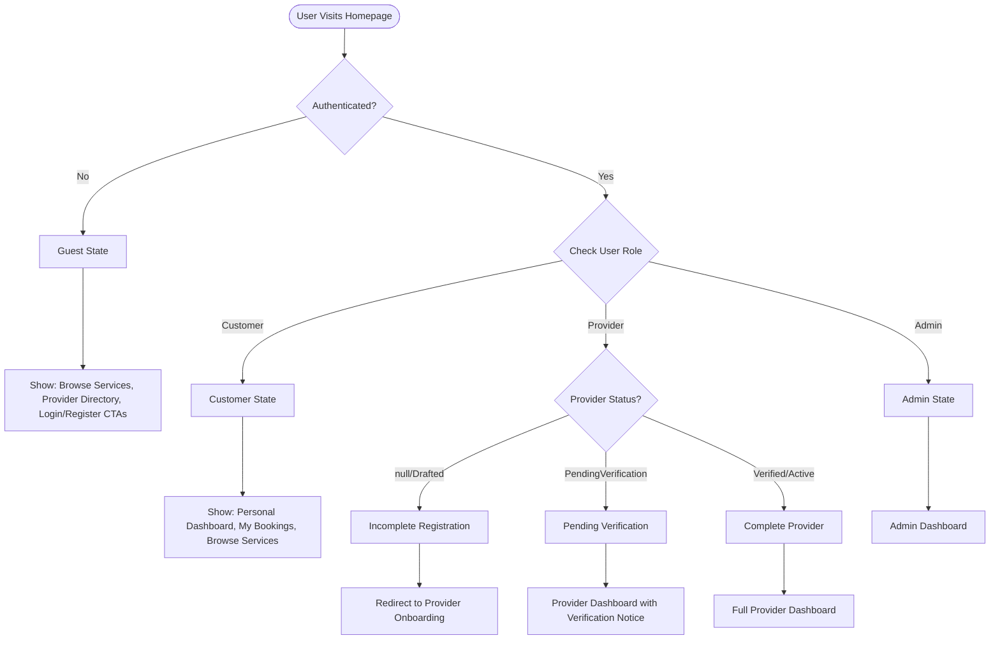
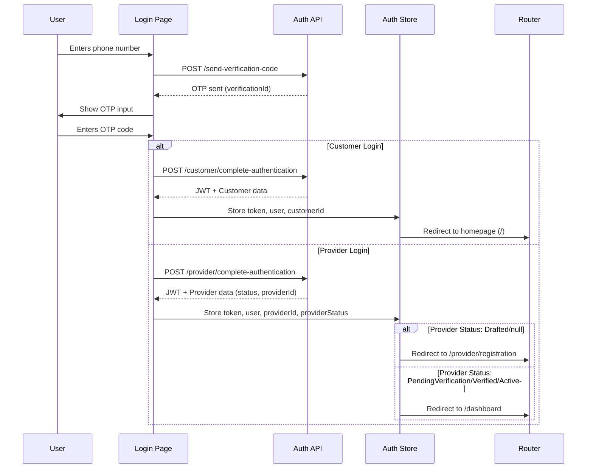
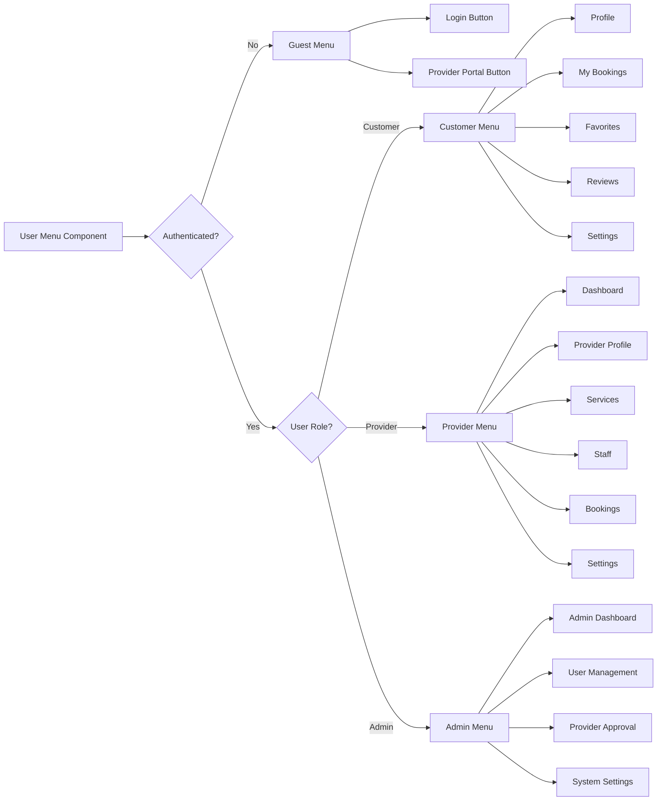

# Role-Based Navigation & User Menu - UX Design Document

**Author**: Senior UI/UX Expert
**Date**: 2025-11-20
**Status**: Design Proposal
**Branch**: `feature/ux-role-based-navigation`

---

## Executive Summary

This document proposes a comprehensive redesign of the authentication flow, redirection logic, and adaptive user menu to provide a seamless experience for three distinct user types: **Guests**, **Customers**, and **Providers**.

### Current State Analysis

✅ **Strengths**:
- Separate login pages for Customers and Providers
- JWT-based authentication with role claims
- Provider status tracking (Drafted, PendingVerification, Verified, Active)
- Basic user menu component

⚠️ **Issues Identified**:
1. **User Menu**: Not role-aware - shows same menu for all authenticated users
2. **Redirection Logic**: Complex and scattered across multiple files
3. **Homepage Experience**: No differentiation between guest, customer, and provider states
4. **Provider Onboarding**: Incomplete registration handling could be clearer
5. **Navigation**: Header navigation not adaptive to user role

---

## 1. User Flow Diagrams

### 1.1 Authentication & Redirection Flow



### 1.2 Login Flow with Role Determination



### 1.3 Dynamic User Menu Flow



---

## 2. UX Recommendations

### 2.1 Role-Based Redirection Strategy

#### Principle: **Intent Preservation**
Always preserve user intent when redirecting. If a customer tries to book a service, redirect them back to that booking flow after authentication.

#### Implementation Rules

| User Type | Status | From | To | Redirect Param Handling |
|-----------|--------|------|-----|------------------------|
| **Guest** | N/A | Any protected route | `/login` | Store `?redirect=/original/path` |
| **Customer** | Active | Login | Homepage `/` | Honor redirect param if exists |
| **Customer** | Active | Protected route | Original route | Allow access |
| **Provider** | Drafted/null | Login | `/provider/registration` | Ignore redirect param |
| **Provider** | Drafted/null | Dashboard | `/provider/registration` | Force onboarding |
| **Provider** | PendingVerification | Login | `/dashboard` | Show verification notice |
| **Provider** | Verified/Active | Login | `/dashboard` | Honor redirect if provider route |
| **Provider** | Verified/Active | Homepage `/` | `/dashboard` | Auto-redirect |
| **Admin** | Active | Login | `/admin/dashboard` | Ignore redirect param |

#### Key Changes Needed:

1. **Auth Guard Enhancement**:
   ```typescript
   // Check if redirect is appropriate for user role
   if (redirectPath) {
     if (isCustomer && isPublicOrCustomerRoute(redirectPath)) {
       // Allow customer redirects to public/customer routes
       router.push(redirectPath)
     } else if (isProvider && isProviderRoute(redirectPath) && isProviderComplete) {
       // Allow provider redirects only if registration complete
       router.push(redirectPath)
     } else {
       // Use role-based default
       redirectToRoleDefault()
     }
   }
   ```

2. **Provider Registration Completion Check**:
   ```typescript
   const isProviderRegistrationComplete = computed(() => {
     return providerStatus.value !== null &&
            providerStatus.value !== ProviderStatus.Drafted
   })
   ```

### 2.2 Dynamic User Menu Design

#### Component Architecture

```typescript
interface UserMenuConfig {
  type: 'guest' | 'customer' | 'provider' | 'admin'
  menuItems: MenuItem[]
  actions: MenuAction[]
  theme?: 'default' | 'business' | 'admin'
}

interface MenuItem {
  id: string
  label: string
  icon: string
  path?: string           // For router-link
  action?: () => void     // For modal/custom action
  badge?: string | number // For notifications
  divider?: boolean       // Show divider after item
}
```

#### Menu Configurations

**Guest Menu**:
```typescript
{
  type: 'guest',
  menuItems: [],
  actions: [
    { label: 'ورود / ثبت‌نام', path: '/login', variant: 'primary' },
    { label: 'پنل کسب‌وکار', path: '/provider/login', variant: 'outlined' }
  ]
}
```

**Customer Menu**:
```typescript
{
  type: 'customer',
  menuItems: [
    { id: 'profile', label: 'پروفایل من', icon: 'user', action: openProfileModal },
    { id: 'bookings', label: 'نوبت‌های من', icon: 'calendar', action: openBookingsModal, badge: pendingCount },
    { id: 'favorites', label: 'علاقه‌مندی‌ها', icon: 'heart', action: openFavoritesModal },
    { id: 'reviews', label: 'نظرات من', icon: 'star', action: openReviewsModal },
    { id: 'settings', label: 'تنظیمات', icon: 'settings', action: openSettingsModal, divider: true },
    { id: 'logout', label: 'خروج', icon: 'logout', action: logout, variant: 'danger' }
  ]
}
```

**Provider Menu**:
```typescript
{
  type: 'provider',
  theme: 'business',
  menuItems: [
    { id: 'dashboard', label: 'داشبورد', icon: 'dashboard', path: '/dashboard' },
    { id: 'profile', label: 'پروفایل کسب‌وکار', icon: 'store', path: '/provider/profile' },
    { id: 'bookings', label: 'رزروها', icon: 'calendar', path: '/provider/bookings', badge: newBookingsCount },
    { id: 'services', label: 'خدمات', icon: 'scissors', path: '/provider/services' },
    { id: 'staff', label: 'کارکنان', icon: 'users', path: '/provider/staff' },
    { id: 'hours', label: 'ساعت کاری', icon: 'clock', path: '/provider/hours' },
    { id: 'settings', label: 'تنظیمات', icon: 'settings', path: '/provider/settings', divider: true },
    { id: 'switch', label: 'رزرو خدمات', icon: 'switch', action: switchToCustomerView },
    { id: 'logout', label: 'خروج', icon: 'logout', action: logout, variant: 'danger' }
  ]
}
```

**Admin Menu**:
```typescript
{
  type: 'admin',
  theme: 'admin',
  menuItems: [
    { id: 'dashboard', label: 'Dashboard', icon: 'dashboard', path: '/admin/dashboard' },
    { id: 'users', label: 'Users', icon: 'users', path: '/admin/users' },
    { id: 'providers', label: 'Providers', icon: 'store', path: '/admin/providers', badge: pendingApprovalCount },
    { id: 'bookings', label: 'Bookings', icon: 'calendar', path: '/admin/bookings' },
    { id: 'reports', label: 'Reports', icon: 'chart', path: '/admin/reports' },
    { id: 'settings', label: 'Settings', icon: 'settings', path: '/admin/settings', divider: true },
    { id: 'logout', label: 'Logout', icon: 'logout', action: logout, variant: 'danger' }
  ]
}
```

### 2.3 Homepage Adaptation

The homepage should adapt its content based on user state:

#### Guest State (`/`)
- Hero section with search
- Featured providers
- How it works
- Testimonials
- CTA: "Start booking" + "Join as provider"

#### Customer State (`/`)
- Personalized greeting: "سلام، {firstName}"
- Quick access to recent bookings
- Recommended providers based on history
- Continue browsing categories
- Show user menu in header

#### Provider State (Auto-redirect to `/dashboard`)
- Don't show homepage
- Immediately redirect to provider dashboard
- Exception: If `?redirect=/` is explicitly set (rare case)

#### Visual Indicator
Add a subtle role indicator in the header:

```vue
<div class="role-indicator" v-if="userRole">
  <span class="role-badge" :class="roleClass">
    {{ roleLabel }}
  </span>
</div>
```

---

## 3. Best Practices for Mixed-Role Platforms

### 3.1 Role Separation Principles

1. **Clear Mental Models**
   - Customers think: "I want to book services"
   - Providers think: "I manage my business"
   - Never mix these contexts in the same interface

2. **Consistent Terminology**
   - Customer side: "رزرو" (Booking), "نوبت" (Appointment)
   - Provider side: "رزروها" (Reservations), "مدیریت" (Management)

3. **Visual Differentiation**
   - Customer theme: Purple gradient (`#667eea` → `#764ba2`)
   - Provider theme: Business blue (`#1976d2` → `#0d47a1`)
   - Admin theme: Dark slate (`#334155` → `#0f172a`)

### 3.2 Navigation Best Practices

#### Rule 1: Single Source of Truth
- User role is determined from JWT token claims
- Provider status comes from backend API
- Store in Pinia `authStore`, never duplicate in components

#### Rule 2: Fail-Safe Redirects
```typescript
const getRoleDefaultPath = (user: User): string => {
  if (hasRole('Admin')) return '/admin/dashboard'
  if (hasRole('Provider')) {
    if (needsOnboarding) return '/provider/registration'
    return '/dashboard'
  }
  if (hasRole('Customer')) return '/'
  return '/' // Default to homepage
}
```

#### Rule 3: Progressive Enhancement
- Load user menu items asynchronously
- Show skeleton while loading
- Gracefully handle missing data

### 3.3 Provider Onboarding UX

**Problem**: Provider creates account but hasn't completed business profile

**Solution**: Multi-step onboarding with progress tracking

```typescript
interface ProviderOnboardingState {
  step: 1 | 2 | 3 | 4 | 5
  completed: boolean[]
  steps: [
    { id: 1, label: 'اطلاعات کسب‌وکار', fields: ['businessName', 'category', 'description'] },
    { id: 2, label: 'موقعیت مکانی', fields: ['address', 'coordinates'] },
    { id: 3, label: 'ساعات کاری', fields: ['businessHours'] },
    { id: 4, label: 'خدمات', fields: ['services'] },
    { id: 5, label: 'تصاویر و گالری', fields: ['images', 'logo'] }
  ]
}
```

**Visual Progress**:
```
[●●●○○] مرحله 3 از 5
```

### 3.4 Role Switching (Future Enhancement)

Allow providers to also book services as customers:

```vue
<div class="role-switcher" v-if="hasMultipleRoles">
  <button @click="switchRole">
    <span v-if="activeRole === 'provider'">
      مشاهده به عنوان مشتری
    </span>
    <span v-else>
      بازگشت به پنل کسب‌وکار
    </span>
  </button>
</div>
```

---

## 4. Implementation Plan

### Phase 1: Foundation (Week 1)
- [ ] Create `RoleBasedMenu.vue` component with configs
- [ ] Enhance `redirectToDashboard()` with intent preservation
- [ ] Add role indicator to header
- [ ] Update auth guard with new logic

### Phase 2: User Menu (Week 1-2)
- [ ] Implement customer menu with modals
- [ ] Implement provider menu with navigation
- [ ] Implement admin menu
- [ ] Add notification badges
- [ ] Add role switching (if multi-role)

### Phase 3: Homepage Adaptation (Week 2)
- [ ] Create `HomeView` role-aware sections
- [ ] Add personalized greeting for customers
- [ ] Implement provider auto-redirect
- [ ] Add analytics tracking by role

### Phase 4: Provider Onboarding (Week 3)
- [ ] Create progress tracker component
- [ ] Implement step validation
- [ ] Add "Save & Continue Later" functionality
- [ ] Add onboarding checklist in dashboard

### Phase 5: Testing & Polish (Week 3-4)
- [ ] E2E tests for each user journey
- [ ] Accessibility audit
- [ ] Performance optimization
- [ ] Documentation updates

---

## 5. Wireframes

### 5.1 Guest Header
```
┌─────────────────────────────────────────────────────────┐
│  [Booksy Logo]                    [Language] [پنل کسب‌وکار] [ورود/ثبت‌نام]  │
└─────────────────────────────────────────────────────────┘
```

### 5.2 Customer Header
```
┌─────────────────────────────────────────────────────────┐
│  [Booksy Logo]          [Language] [نوبت‌های من 3] [👤 سارا ▼] │
└─────────────────────────────────────────────────────────┘
                                                │
                        ┌───────────────────────┐
                        │ 👤 پروفایل من         │
                        │ 📅 نوبت‌های من (3)    │
                        │ ❤️ علاقه‌مندی‌ها      │
                        │ ⭐ نظرات من          │
                        │ ⚙️ تنظیمات           │
                        │ ────────────────────  │
                        │ 🚪 خروج              │
                        └───────────────────────┘
```

### 5.3 Provider Header
```
┌─────────────────────────────────────────────────────────┐
│  [Booksy Logo] [📊 داشبورد] [📅 رزروها] [🧑‍💼 Ali's Salon ▼] │
└─────────────────────────────────────────────────────────┘
                                                │
                        ┌───────────────────────┐
                        │ 📊 داشبورد            │
                        │ 🏪 پروفایل کسب‌وکار   │
                        │ 📅 رزروها (12)        │
                        │ ✂️ خدمات              │
                        │ 👥 کارکنان            │
                        │ 🕐 ساعت کاری          │
                        │ ⚙️ تنظیمات           │
                        │ ────────────────────  │
                        │ 🔄 رزرو خدمات         │
                        │ 🚪 خروج              │
                        └───────────────────────┘
```

---

## 6. Technical Specifications

### 6.1 New Composables

**`useRoleBasedNavigation.ts`**
```typescript
export function useRoleBasedNavigation() {
  const authStore = useAuthStore()
  const router = useRouter()

  const userRole = computed(() => {
    if (!authStore.isAuthenticated) return 'guest'
    if (authStore.hasRole('Admin')) return 'admin'
    if (authStore.hasRole('Provider')) return 'provider'
    if (authStore.hasRole('Customer')) return 'customer'
    return 'guest'
  })

  const menuConfig = computed(() => {
    return getMenuConfigForRole(userRole.value, authStore)
  })

  const redirectToRoleDefault = async (intentPath?: string) => {
    // Implementation with intent preservation
  }

  return {
    userRole,
    menuConfig,
    redirectToRoleDefault
  }
}
```

### 6.2 Route Meta Enhancement

```typescript
{
  path: '/dashboard',
  name: 'ProviderDashboard',
  component: () => import('@/modules/provider/views/DashboardView.vue'),
  meta: {
    requiresAuth: true,
    roles: ['Provider'],
    requiresCompleteOnboarding: true,  // NEW
    layout: 'provider',                 // NEW
    title: 'داشبورد کسب‌وکار'
  }
}
```

### 6.3 Auth Store Enhancement

```typescript
// Add to auth.store.ts
const isProviderOnboardingComplete = computed(() => {
  return providerStatus.value !== null &&
         providerStatus.value !== ProviderStatus.Drafted &&
         providerId.value !== null
})

const activeRole = ref<'customer' | 'provider'>('customer') // For role switching

function switchRole(role: 'customer' | 'provider') {
  activeRole.value = role
  if (role === 'provider' && hasRole('Provider')) {
    router.push('/dashboard')
  } else {
    router.push('/')
  }
}
```

---

## 7. Metrics & Success Criteria

### User Experience Metrics

| Metric | Current (Baseline) | Target |
|--------|-------------------|--------|
| Time to Dashboard (Provider) | ~3.2s | <2s |
| Redirect Confusion Rate | ~15% | <5% |
| Onboarding Completion | ~60% | >85% |
| Role Switch Success | N/A | >95% |
| Menu Discoverability | ~70% | >90% |

### Technical Metrics

| Metric | Target |
|--------|--------|
| Auth Guard Performance | <50ms |
| Menu Render Time | <100ms |
| Redirect Decision Time | <10ms |
| User Menu Bundle Size | <15KB |

---

## 8. Accessibility Considerations

1. **Keyboard Navigation**
   - Tab through menu items
   - Enter/Space to activate
   - Escape to close dropdown

2. **Screen Reader Support**
   - ARIA labels for all menu items
   - Role announcements
   - Status updates for redirects

3. **Visual Indicators**
   - High contrast mode support
   - Clear focus states
   - Loading indicators

---

## 9. Security Considerations

1. **Role Validation**
   - Always verify roles server-side
   - Don't trust client-side role checks
   - JWT signature validation

2. **Redirect Safety**
   - Whitelist allowed redirect paths
   - Prevent open redirects
   - Validate redirect domains

3. **Session Management**
   - Clear sensitive data on logout
   - Token refresh handling
   - Concurrent session policies

---

## 10. Future Enhancements

1. **Multi-Role Support**
   - Users can be both Customer and Provider
   - Seamless role switching
   - Unified notification center

2. **Smart Redirects**
   - ML-based intent prediction
   - Usage pattern learning
   - Personalized dashboard layouts

3. **Progressive Web App**
   - Install prompt based on role
   - Role-specific offline capabilities
   - Push notifications by role

---

## Conclusion

This comprehensive redesign ensures that each user type (Guest, Customer, Provider, Admin) receives a tailored, intuitive experience. By implementing role-based navigation, adaptive menus, and intelligent redirects, we create a platform that feels native to each user's context while maintaining a cohesive brand identity.

**Next Steps**:
1. Review and approve this design document
2. Create detailed component specifications
3. Begin Phase 1 implementation
4. Set up A/B testing framework for validation

---

**Document Version**: 1.0
**Last Updated**: 2025-11-20
**Approved By**: [Pending Review]
