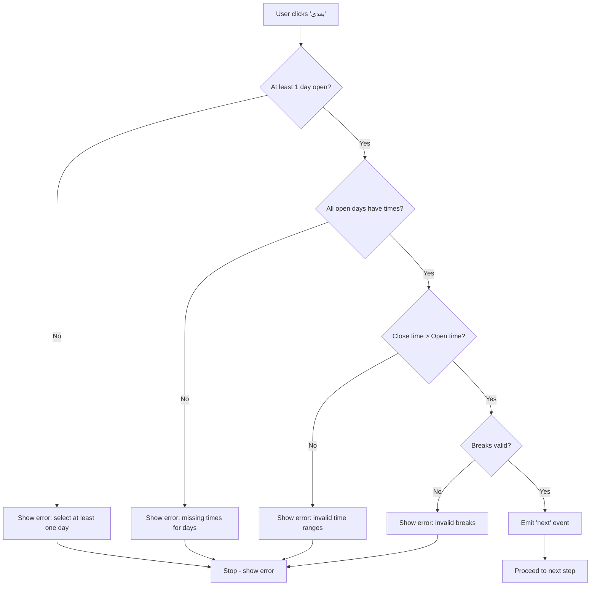
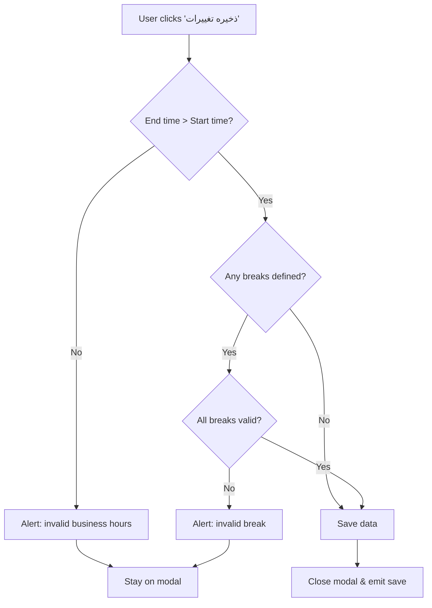

# Working Hours Validation Rules

**Date**: 2025-11-26
**Status**: ✅ Implemented
**Components**: WorkingHoursStepNew, DayScheduleModal

---

## Overview

Comprehensive client-side validation for working hours and break times to ensure data integrity before submission to the backend.

---

## Validation Rules

### 1. **At Least One Day Open**
- **Rule**: At least one day of the week must be marked as open
- **Error Message**: `لطفاً حداقل یک روز کاری را انتخاب کنید`
- **When**: On form submission

```typescript
const hasOpenDay = schedule.value.some((day) => day.isOpen)
if (!hasOpenDay) {
  error.value = 'لطفاً حداقل یک روز کاری را انتخاب کنید'
}
```

---

### 2. **Valid Business Hours Required**
- **Rule**: All open days must have both start time and end time
- **Error Message**: `لطفاً ساعات کاری را برای روزهای زیر تعیین کنید: [day names]`
- **When**: On form submission

```typescript
const invalidDays: string[] = []
schedule.value.forEach((day, index) => {
  if (day.isOpen) {
    if (!day.openTime || !day.closeTime) {
      invalidDays.push(weekDays[index])
    }
  }
})
```

---

### 3. **End Time After Start Time**
- **Rule**: Close time must be strictly greater than open time (not equal)
- **Error Message**:
  - Form: `ساعت پایان باید بعد از ساعت شروع باشد برای: [day names]`
  - Modal: `ساعت پایان باید بعد از ساعت شروع باشد`
- **When**: On form submission and modal save

**Invalid Examples**:
```
❌ Open: 10:00, Close: 10:00 (equal - not allowed)
❌ Open: 14:00, Close: 12:00 (end before start)
✅ Open: 10:00, Close: 22:00 (valid)
✅ Open: 09:00, Close: 09:30 (valid - 30 min difference)
```

**Implementation**:
```typescript
const openMinutes = day.openTime.hours * 60 + day.openTime.minutes
const closeMinutes = day.closeTime.hours * 60 + day.closeTime.minutes

if (closeMinutes <= openMinutes) {  // Note: <= not just <
  invalidTimeRanges.push(weekDays[index])
}
```

---

### 4. **Break End After Break Start**
- **Rule**: Break end time must be strictly greater than break start time
- **Error Message**:
  - Form: `[day name] (زمان پایان استراحت باید بعد از شروع باشد)`
  - Modal: `ساعت پایان استراحت ${i + 1} باید بعد از ساعت شروع آن باشد`
- **When**: On form submission and modal save

**Invalid Examples**:
```
❌ Break Start: 14:00, Break End: 14:00 (equal - not allowed)
❌ Break Start: 15:00, Break End: 14:00 (end before start)
✅ Break Start: 14:00, Break End: 17:00 (valid)
```

**Implementation**:
```typescript
const breakStartMinutes = breakPeriod.start.hours * 60 + breakPeriod.start.minutes
const breakEndMinutes = breakPeriod.end.hours * 60 + breakPeriod.end.minutes

if (breakEndMinutes <= breakStartMinutes) {  // Note: <= not just <
  // Error
}
```

---

### 5. **Breaks Within Business Hours**
- **Rule**: All breaks must start and end within the business hours of that day
- **Error Message**:
  - Form: `[day name] (استراحت باید در بازه ساعات کاری باشد)`
  - Modal: `استراحت ${i + 1} باید در بازه ساعات کاری باشد`
- **When**: On form submission and modal save

**Examples**:

```
Business Hours: 10:00 - 22:00

✅ Valid Breaks:
   - 14:00 - 17:00 (completely within)
   - 10:00 - 12:00 (starts at open time)
   - 20:00 - 22:00 (ends at close time)
   - 10:00 - 22:00 (full day break - technically valid)

❌ Invalid Breaks:
   - 09:00 - 11:00 (starts before open time)
   - 21:00 - 23:00 (ends after close time)
   - 08:00 - 12:00 (starts before open time)
   - 20:00 - 23:00 (ends after close time)
```

**Implementation**:
```typescript
// Check if break is within business hours
if (breakStartMinutes < openMinutes || breakEndMinutes > closeMinutes) {
  // Error: break outside business hours
}

// Additional check: break not completely outside business hours
if (breakStartMinutes >= closeMinutes || breakEndMinutes <= openMinutes) {
  // Error: break completely outside
}
```

---

## Validation Flow

### Form Submission (WorkingHoursStepNew)



### Modal Save (DayScheduleModal)



---

## Error Messages (Persian)

| Validation Rule | Error Message |
|-----------------|---------------|
| No days open | `لطفاً حداقل یک روز کاری را انتخاب کنید` |
| Missing times | `لطفاً ساعات کاری را برای روزهای زیر تعیین کنید: [days]` |
| Invalid time range | `ساعت پایان باید بعد از ساعت شروع باشد برای: [days]` |
| Invalid break time | `[day] (زمان پایان استراحت باید بعد از شروع باشد)` |
| Break outside hours | `[day] (استراحت باید در بازه ساعات کاری باشد)` |
| Break completely outside | `[day] (استراحت خارج از ساعات کاری است)` |

---

## Code Examples

### Example 1: Valid Schedule

```typescript
{
  dayOfWeek: 0, // Saturday
  isOpen: true,
  openTime: { hours: 10, minutes: 0 },
  closeTime: { hours: 22, minutes: 0 },
  breaks: [
    {
      id: '1',
      start: { hours: 14, minutes: 0 },
      end: { hours: 17, minutes: 0 }
    }
  ]
}
```

✅ **Validation Result**: PASS
- Day is open ✓
- Has both open and close times ✓
- Close time (22:00) > Open time (10:00) ✓
- Break end (17:00) > Break start (14:00) ✓
- Break within business hours (14:00-17:00 is within 10:00-22:00) ✓

---

### Example 2: Invalid - Break Outside Hours

```typescript
{
  dayOfWeek: 1, // Sunday
  isOpen: true,
  openTime: { hours: 10, minutes: 0 },
  closeTime: { hours: 18, minutes: 0 },
  breaks: [
    {
      id: '1',
      start: { hours: 17, minutes: 0 },
      end: { hours: 20, minutes: 0 }  // ❌ Ends after close time
    }
  ]
}
```

❌ **Validation Result**: FAIL
- Error: `یکشنبه (استراحت باید در بازه ساعات کاری باشد)`
- Reason: Break ends at 20:00, but business closes at 18:00

---

### Example 3: Invalid - Equal Times

```typescript
{
  dayOfWeek: 2, // Monday
  isOpen: true,
  openTime: { hours: 9, minutes: 0 },
  closeTime: { hours: 9, minutes: 0 },  // ❌ Equal to open time
  breaks: []
}
```

❌ **Validation Result**: FAIL
- Error: `ساعت پایان باید بعد از ساعت شروع باشد برای: دوشنبه`
- Reason: Close time equals open time (both 9:00)

---

### Example 4: Invalid - Break Time Overlap

```typescript
{
  dayOfWeek: 3, // Tuesday
  isOpen: true,
  openTime: { hours: 10, minutes: 0 },
  closeTime: { hours: 22, minutes: 0 },
  breaks: [
    {
      id: '1',
      start: { hours: 15, minutes: 0 },
      end: { hours: 15, minutes: 0 }  // ❌ Equal times
    }
  ]
}
```

❌ **Validation Result**: FAIL
- Error: `سه‌شنبه (زمان پایان استراحت باید بعد از شروع باشد)`
- Reason: Break start equals break end

---

## Edge Cases

### Edge Case 1: Full Day Break

```typescript
// Business hours: 10:00 - 22:00
// Break: 10:00 - 22:00 (entire day)
```

**Result**: ✅ **Technically valid** (break within hours)
**Note**: Server may want to add additional business logic to prevent this

---

### Edge Case 2: Midnight Crossing

```typescript
// Business hours: 22:00 - 02:00 (next day)
```

**Current Implementation**: ❌ **Not supported**
**Reason**: Validation uses simple minute comparison, doesn't handle day boundaries
**Solution**: Current system assumes business hours don't cross midnight

---

### Edge Case 3: Multiple Breaks

```typescript
breaks: [
  { id: '1', start: { hours: 12, minutes: 0 }, end: { hours: 13, minutes: 0 } },
  { id: '2', start: { hours: 15, minutes: 0 }, end: { hours: 16, minutes: 0 } }
]
```

**Result**: ✅ **Valid** (each break validated independently)
**Note**: No check for overlapping breaks (server responsibility)

---

## Time Conversion

All times are converted to minutes since midnight for comparison:

```typescript
const timeToMinutes = (time: { hours: number, minutes: number }): number => {
  return time.hours * 60 + time.minutes
}

// Examples:
// 00:00 => 0
// 10:00 => 600
// 14:30 => 870
// 23:59 => 1439
```

---

## Components Involved

### 1. WorkingHoursStepNew.vue
**Location**: `booksy-frontend/src/modules/provider/components/registration/steps/WorkingHoursStepNew.vue`

**Validates**:
- At least one day open
- All open days have times
- Close time > open time for all days
- All breaks valid for all days

**Validation Trigger**: Click "بعدی" button

---

### 2. DayScheduleModal.vue
**Location**: `booksy-frontend/src/shared/components/schedule/DayScheduleModal.vue`

**Validates**:
- End time > start time
- Break end > break start (for each break)
- Breaks within business hours (for each break)

**Validation Trigger**: Click "ذخیره تغییرات" button

---

## Default Values

### New Registration
```typescript
{
  dayOfWeek: index,
  isOpen: true,  // All days open by default
  openTime: { hours: 10, minutes: 0 },
  closeTime: { hours: 22, minutes: 0 },
  breaks: [
    {
      id: '1',
      start: { hours: 14, minutes: 0 },
      end: { hours: 17, minutes: 0 }
    }
  ]
}
```

### Toggling Day to Open
```typescript
{
  startTime: '10:00',
  endTime: '22:00',
  breaks: [
    {
      id: '1',
      start: '14:00',
      end: '17:00'
    }
  ]
}
```

---

## User Experience

### Good UX Practices

✅ **Validate on submit** - Don't block user while typing
✅ **Clear error messages** - In Persian, specific to the issue
✅ **Field-level validation** - Shows which day has the problem
✅ **Modal validation** - Immediate feedback before saving
✅ **Visual feedback** - Error message displayed prominently

### Error Display

```vue
<!-- Error shown at bottom of form -->
<p v-if="error" class="error-message">{{ error }}</p>
```

**Styling**:
```scss
.error-message {
  font-size: 0.875rem;
  color: #ef4444;  // Red
  text-align: center;
}
```

---

## Testing Scenarios

### Test 1: Valid Full Week
```
✅ All days: 10:00-22:00 with 14:00-17:00 break
Expected: Pass validation
```

### Test 2: Invalid Time Range
```
❌ Saturday: 22:00-10:00 (backwards)
Expected: Error "ساعت پایان باید بعد از ساعت شروع باشد برای: شنبه"
```

### Test 3: Break Outside Hours
```
❌ Sunday: Hours 10:00-18:00, Break 16:00-20:00
Expected: Error "یکشنبه (استراحت باید در بازه ساعات کاری باشد)"
```

### Test 4: No Days Open
```
❌ All days closed
Expected: Error "لطفاً حداقل یک روز کاری را انتخاب کنید"
```

### Test 5: Missing Times
```
❌ Monday open but no times set
Expected: Error "لطفاً ساعات کاری را برای روزهای زیر تعیین کنید: دوشنبه"
```

---

## Future Enhancements

### 1. Overlapping Break Detection
Prevent breaks from overlapping:
```typescript
// Check if breaks overlap
for (let i = 0; i < breaks.length - 1; i++) {
  for (let j = i + 1; j < breaks.length; j++) {
    if (breaksOverlap(breaks[i], breaks[j])) {
      // Error
    }
  }
}
```

### 2. Minimum Duration Validation
Ensure business is open for minimum hours:
```typescript
const durationMinutes = closeMinutes - openMinutes
if (durationMinutes < 60) {  // Less than 1 hour
  error = 'کسب‌وکار باید حداقل ۱ ساعت باز باشد'
}
```

### 3. Break Duration Validation
Ensure breaks have minimum/maximum duration:
```typescript
const breakDuration = breakEndMinutes - breakStartMinutes
if (breakDuration < 15) {  // Less than 15 minutes
  error = 'استراحت باید حداقل ۱۵ دقیقه باشد'
}
```

### 4. Total Break Time Validation
Ensure total break time doesn't exceed business hours:
```typescript
const totalBreakTime = breaks.reduce((sum, b) =>
  sum + (b.endMinutes - b.startMinutes), 0
)
const businessDuration = closeMinutes - openMinutes

if (totalBreakTime >= businessDuration) {
  error = 'مجموع زمان استراحت نباید بیشتر از ساعات کاری باشد'
}
```

---

## Related Documentation

- [VALIDATION_ERROR_HANDLING.md](./VALIDATION_ERROR_HANDLING.md) - Server-side validation error display
- [FIX_REGISTRATION_STEP_DATA_SYNC.md](./FIX_REGISTRATION_STEP_DATA_SYNC.md) - Data synchronization fixes

---

**Status**: ✅ Production Ready
**Last Updated**: 2025-11-26
**Maintained By**: Development Team
